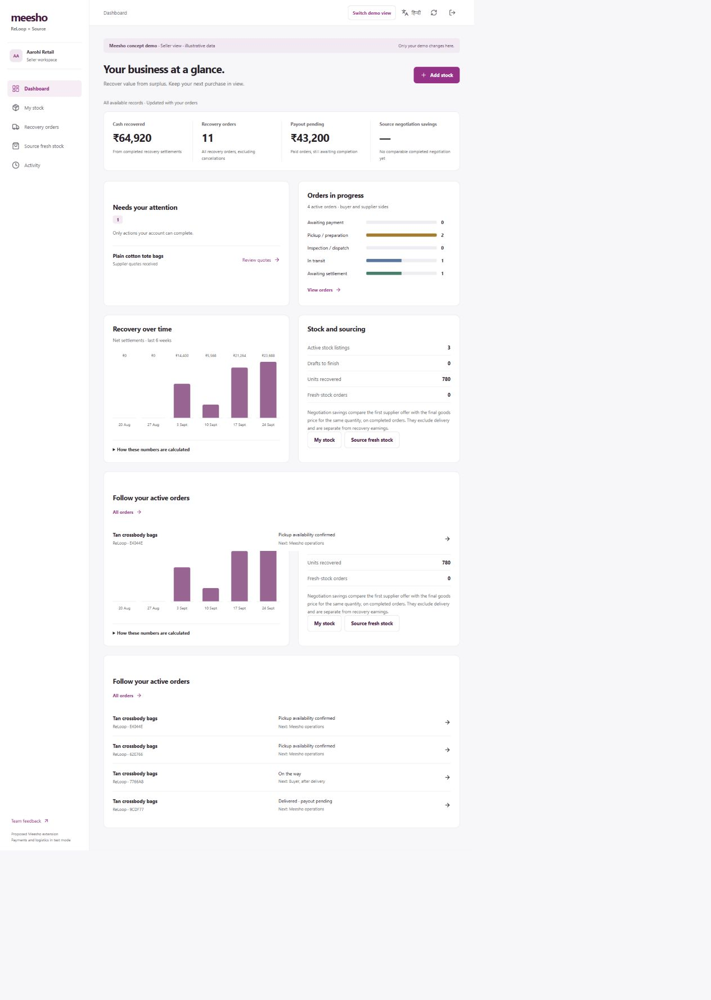
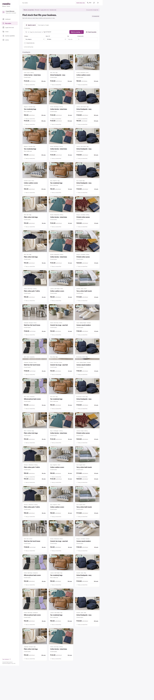
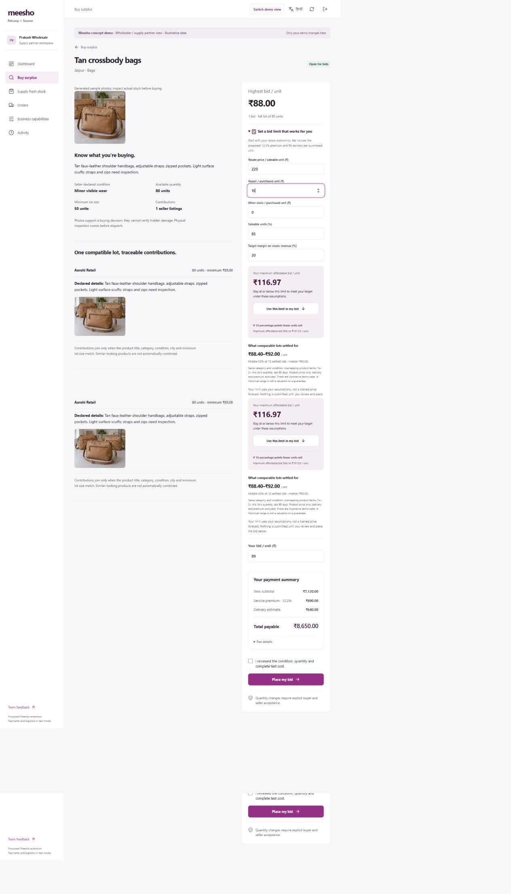
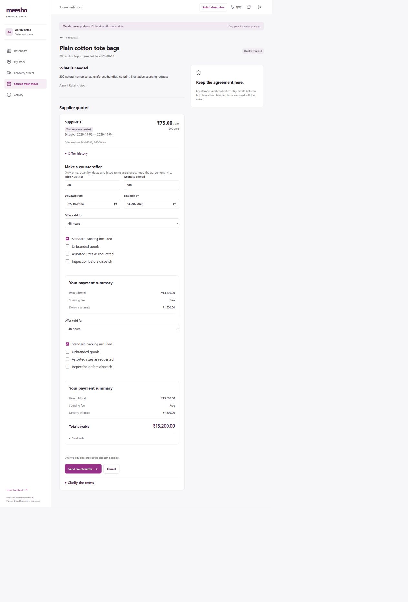
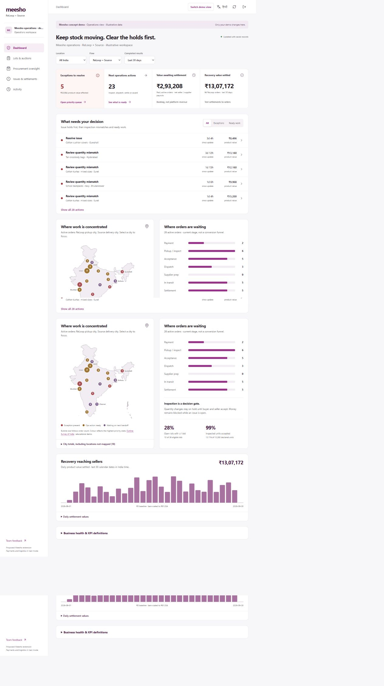
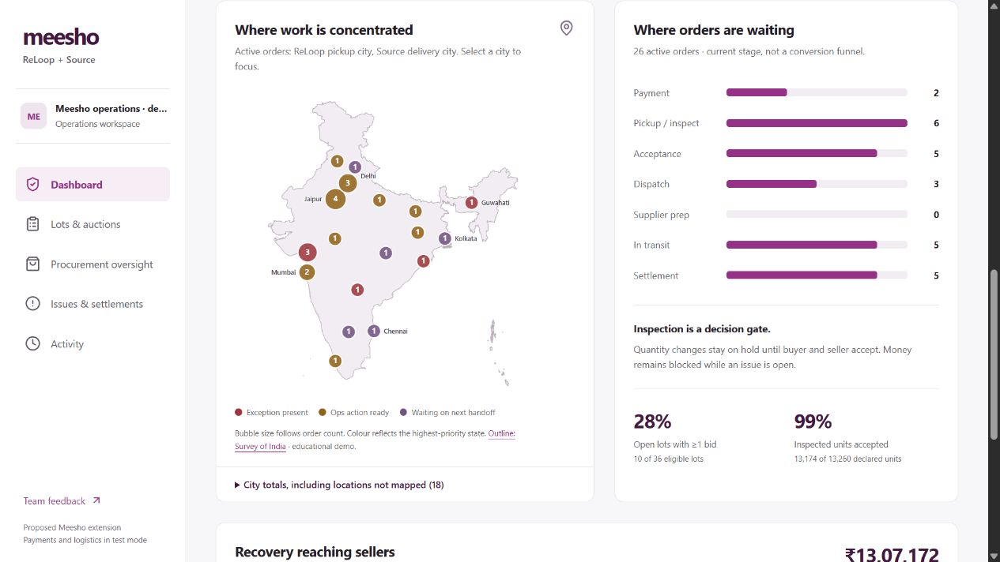
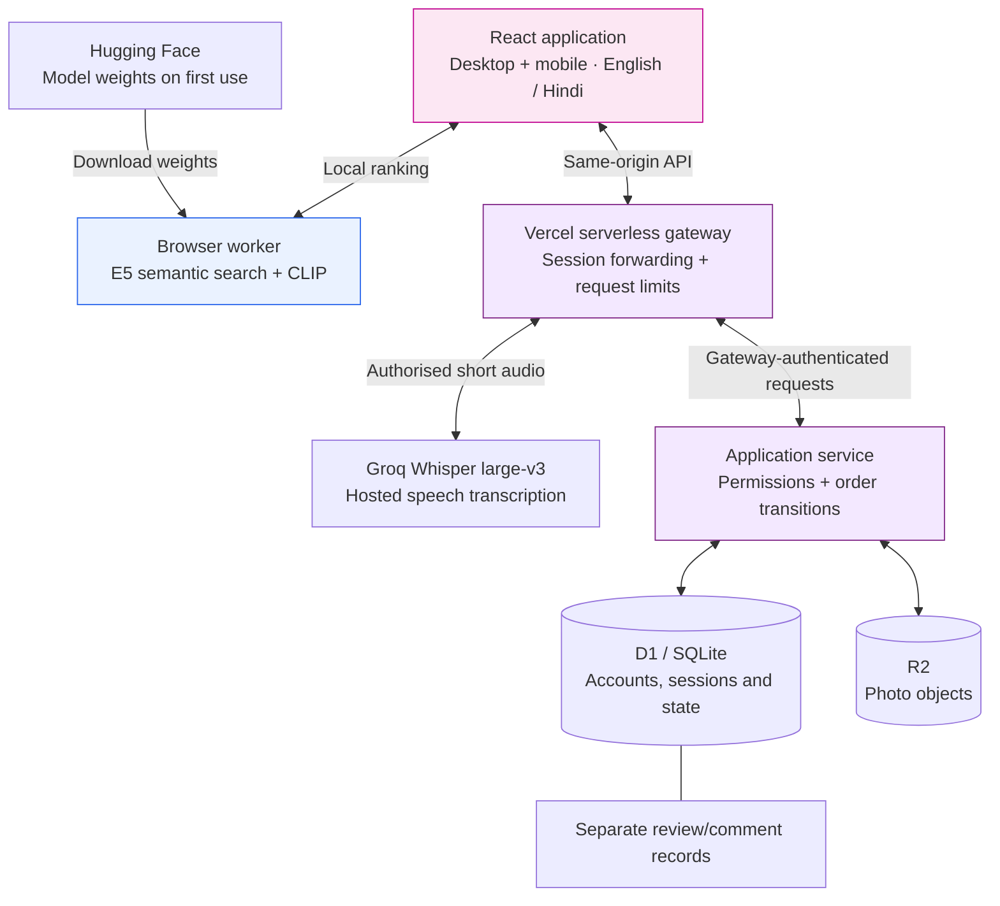

# ReLoop + Source

**Recover stranded stock. Source the next order. Keep every handoff accountable.**

Final challenge application · **Dicey Business / IIT Guwahati** · Meesho DICE 3.0

[Open the live application](https://reloop-source.vercel.app) · [Architecture](docs/ARCHITECTURE.md) · [Run locally](#run-locally) · [Release record](docs/FINAL-RELEASE.md) · [Demo Video (~ 8 mins)](https://drive.google.com/file/d/1mD7zHmcE0ldjEytjGON-XGYbpoQtlBBX/view?usp=sharing) 

> Proposed extension to Meesho, built for the challenge—not an official Meesho service or integration. The application runs real software workflows; demo inventory and operational figures are illustrative. Payments, courier events, refunds and settlements are test events.



## Three workspaces. Two connected journeys.

| Workspace | What it does |
|---|---|
| **Meesho seller** | Dashboard, own inventory and photo evidence, recovery orders, pickup availability, fresh-stock requests and negotiation |
| **Wholesaler / supply partner** | One account with buying and supplying capabilities: surplus discovery, bids, fresh-stock quotes and fulfilment |
| **Meesho operations** | Prioritised dashboard, lots and auctions, procurement oversight, inspection decisions, issues and settlements |

The entry chooser opens an isolated, server-backed demo. Switching roles preserves the same visitor's journey. Saved accounts are separate; private operator credentials are never embedded in the public chooser.

### ReLoop — stock becomes recovered cash

```mermaid
flowchart LR
  A[Seller: My stock<br/>Photos, quantity and reserve] --> B[Partner: Buy surplus<br/>Search and review lot]
  B --> C[Partner: Bid guidance<br/>Budget check and bid]
  C --> D[Ops: Lots & auctions<br/>Award eligible bid]
  D --> E[Partner: Orders<br/>Test payment]
  E --> F[Seller: Recovery orders<br/>Confirm pickup availability]
  F --> G[Ops: Inspection<br/>Record accepted quantity]
  G --> H{Affected parties<br/>accept?}
  H -->|Yes| I[Ops dispatch → buyer receipt]
  H -->|No| J[Hold / resolve / cancel]
  I --> K{Open issue?}
  K -->|No| L[Ops: Record test settlement]
  K -->|Yes| J
  classDef seller fill:#fce7f3,stroke:#c0008f,color:#4a123f;
  classDef partner fill:#eaf2ff,stroke:#2563eb,color:#17346b;
  classDef ops fill:#f3e8ff,stroke:#7e2285,color:#421348;
  class A,F seller;
  class B,C,E partner;
  class D,G,H,I,J,K,L ops;
```



### Source — request, negotiate, agree, fulfil


Source currently uses **requests and supplier quotes**, not a standalone supplier-stock catalogue. Negotiation uses structured terms and preset clarifications, rather than exchanging phone numbers or unrestricted messages.

## The prototype in use

| Discover eligible stock | Understand the bid budget |
|---|---|
|  |  |
| Typed, spoken and reference-photo input; category, location, condition and quantity constraints. | Buyer-entered resale and cost assumptions produce a transparent ceiling; submission remains explicit. |

| Negotiate inside Source | Prioritise operations |
|---|---|
|  |  |
| Private offer history, validity windows and an accepted version saved with the order. | Exceptions and ready actions first; secondary geography, stage and outcome metrics. |

<details>
<summary>View the geographic operations panel</summary>



Bubble size reflects active-order volume. Colour reflects exception, ready action or waiting status. Figures are demo records, not national Meesho performance.
</details>

Screenshots are from the final journey walkthrough. The subsequently removed “Team feedback” navigation link may still appear in these historical captures; it is absent from the final live build.

## Useful intelligence, with clear boundaries

| Capability | Implementation | What it does **not** claim |
|---|---|---|
| Multilingual semantic search | Quantised multilingual E5 embeddings, Transformers.js and ONNX Runtime in a browser worker | A custom-trained marketplace model or measured Hindi accuracy |
| Reference-photo search | CLIP ranks eligible inventory descriptions against the supplied image | Seller-photo similarity search, authenticity checks or damage grading |
| Hindi / English / Hinglish voice | Short recording → server gateway → Groq Whisper large-v3 → editable transcript | Perfect recognition; users review text before searching |
| Bid-budget assistance | Transparent resale, saleable-share, repair, margin and landed-cost calculation | Autonomous bidding or an ML price forecast |
| Comparable-sale evidence | Filtered recent settlements; quartiles and median only when enough comparables exist | A reliable valuation from sparse or synthetic data |
| Photo evidence checks | Basic quality and repeated-view heuristics | A substitute for physical inspection |
| Business dashboards | Recorded cash, pending payouts, dated outcomes and explicitly based savings | Revenue or profit inferred from gross transaction value |

**BharatMLStack is not deployed.** There is no live Meesho API integration. The implemented ML is pretrained inference; the demo does not retrain models after transactions.

## Technical overview



Browser text/photo matching runs locally after model downloads. Voice audio is sent for hosted transcription. Backend rules enforce ownership, capability and state transitions; navigation visibility is not the permission boundary.

### Pricing in this release

| Flow | Buyer pays | Seller / supplier receives |
|---|---|---|
| **ReLoop** | Goods + **12.5% buyer premium** + delivery estimate | Cleared goods value; no seller fee |
| **Source** | Goods + delivery estimate; no sourcing fee added | Goods value less **4.5% supplier fee** |

Delivery is a **₹8/unit demo assumption**, not a live courier quote or proof of logistics revenue. Each participant sees their own payment or payout breakdown; operations sees reconciliation. Money is calculated in integer paise. No dynamic fee engine is implemented.

## Run locally

Use **Node.js 24** and npm. The local preview uses an in-memory SQLite database and in-memory photo storage; restarting clears that preview. It never connects to the production database.

```bash
npm ci --prefix prototype/reloop-app
npm run build
npm test
npm run preview
```

Open **http://127.0.0.1:4327** and choose a demo persona. Browser model downloads need internet access. This isolated preview does **not** run the hosted speech gateway; voice requires the configured Vercel environment.

Optional backend build tooling:

```bash
npm ci --prefix prototype/reloop-shared-review
npm run build --prefix prototype/reloop-shared-review
```

### Environment and deployment

Vercel's project root is **`prototype/reloop-app`**, not the repository root. The deployed app uses:

| Setting | Where | Purpose |
|---|---|---|
| `RELOOP_API_ORIGIN` | Vercel | Existing application service origin |
| `RELOOP_GATEWAY_SECRET` | Vercel | Server-to-server authentication |
| `GROQ_API_KEY` | Vercel | Hosted voice transcription |
| `APP_GATEWAY_SECRET` | Backend | Must match the gateway secret |
| `APP_SETUP_SECRET` | Backend | Private operator setup |
| `DB`, `BUCKET` | Backend bindings | D1 database and R2 objects |

Keep credentials in provider settings or ignored local environment files. See [deployment notes](docs/ARCHITECTURE.md#deployment-boundaries). No production data, credentials, account recovery codes or review-comment exports are included here.

## Repository guide

```text
prototype/
  reloop-app/             Final Vercel frontend, gateway, speech handler and tests
  reloop-shared-review/   Backend domain logic, services, migrations and tests
docs/
  ARCHITECTURE.md         Boundaries, state transitions and technical decisions
  FINAL-RELEASE.md        Live-build identity and verification record
  images/                Walkthrough screenshots
legacy/round-1/           Preserved earlier Next.js concept prototype
competition-materials/  Existing derived research; historical context
```

Historical dated notes under the application folders record earlier decisions; this README and the final-release record describe the approved final state. The older four-persona design and browser/on-device speech options are superseded.

## Validation and limits

The test suites cover pricing and financial visibility, three-persona permissions, demo isolation, negotiation, inspection acceptance, settlement holds, saved sessions, photo access, concurrency, dashboard calculations and review-comment preservation. See the release record for the final run results.

This is a judge-ready challenge application, not a commercial marketplace launch. Production commerce would still need verified businesses, live payment/tax/logistics integrations, durable operational monitoring, scale testing and domain-specific model evaluation. No real money is collected by the demo.

**Public project repository.** The code matches the approved final live application, verified again on 5 October 2026. Competition briefs, raw interview recordings and production credentials are excluded. Third-party libraries retain their own licences; the map's educational-use provenance is documented with its asset.
