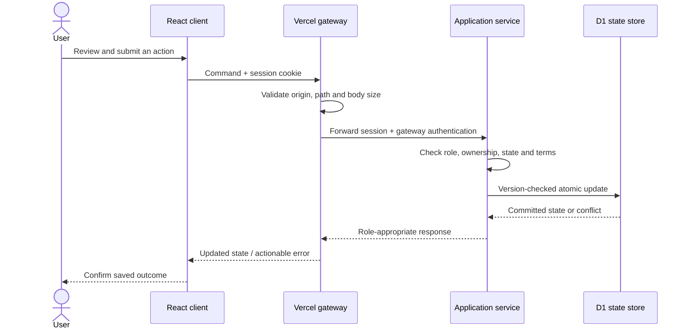

# Final application architecture

[Back to README](../README.md)

## Request and data boundaries

The UI is React 19 bundled with esbuild. Responsive CSS and client localisation implement the seller, partner and operations workspaces. Vercel routes same-origin API requests through `api/gateway.js`. The backend Worker delegates application routes to `application-service.mjs` and domain operations to `app-domain.mjs` and related modules.

The managed Sites backend provides D1/SQLite and R2 bindings. This repository contains the service implementation and SQL migrations, not a production database dump. Existing review/comment service code remains separate from application records. Removing its navigation link did not remove stored comments.

## State controls

```mermaid
stateDiagram-v2
  [*] --> AwaitingPayment: Auction awarded
  AwaitingPayment --> Pickup: Test payment recorded
  AwaitingPayment --> Cancelled: Cancel unpaid order
  Pickup --> InspectionReview: Record inspected quantities
  InspectionReview --> ReadyDispatch: All required parties accept
  InspectionReview --> Cancelled: Permitted rejection and cancellation
  ReadyDispatch --> Shipped: Operations records dispatch
  Shipped --> Delivered: Buyer confirms receipt
  Delivered --> Settled: Operations settles; no open issue
  Settled --> [*]
```

This diagram describes ReLoop. Source follows accepted offer → payment → supplier fulfilment → dispatch → receipt → settlement. Open issues prevent settlement. A chosen pickup window is the seller's availability; it is not an obligation to source a courier. Courier booking and physical events are simulated.

## Search and speech

1. Apply category, location, condition and quantity eligibility before model ranking.
2. For text search, embed the query and descriptions with quantised `Xenova/multilingual-e5-small`; compare normalised vectors.
3. For photo search, use quantised `Xenova/clip-vit-base-patch32` against candidate descriptions. This is not image-to-image stock matching.
4. Transformers.js and ONNX Runtime execute inside a browser worker. Model weights load on demand from Hugging Face; initial use can be slower.
5. For voice, record at most 25 seconds, validate mono 16 kHz WAV, authorise session/quota on the backend, and forward audio through the server to Groq `whisper-large-v3`. Return editable text. Keys stay server-side.

Bid guidance remains a deterministic margin calculation plus filtered historical evidence. It is deliberately not labelled a trained price-prediction model. No automatic bid submission, automated grading, BharatMLStack service or continuous model-learning loop exists in this release.

## Permissions and privacy

- Server checks separate seller, buyer, supplier and operations capabilities within three visible personas.
- Demo rooms isolate visitors and expire; the public demo operator cannot operate on saved accounts.
- Passwords use salted hashing; sessions use opaque HttpOnly cookies. Recovery uses a displayed recovery code.
- Gateway forwards application cookies separately and excludes unrelated upstream cookies.
- Draft photo access, published evidence access and private negotiation histories have server-side checks.
- Participants see their own bill or payout; operations can reconcile both sides.
- No secrets, production account records or private comment exports are versioned.

## Deployment boundaries

The live frontend is **https://reloop-source.vercel.app**. Its existing Vercel configuration points to the backend origin. This GitHub finalisation does not redeploy either service or reconnect Git integration.

For a future Git-based Vercel deployment, explicitly set the project root to `prototype/reloop-app`; do not deploy `legacy/round-1`. Configure the environment variables listed in the README. The backend has its own managed hosting bindings and deployment process; its `.openai/hosting.json` is existing project metadata, not an authentication credential or a portable cloud provisioner.

The local preview uses an in-memory adapter for backend behaviour. It is suitable for demo exploration and regression checks, not persistent development storage or hosted speech testing. Apply migrations only through the intended backend deployment workflow; never run them against production merely to try the demo.

## Third-party assets

Browser runtime files retain the Transformers.js licence in `prototype/reloop-app/public/vendor`. Model identifiers and implementation live in `public/ml-worker.js`. The India map is an educational-use asset with provenance in `public/assets` and the dated operations notes. Sample stock images are illustrative and are not product authenticity evidence.
